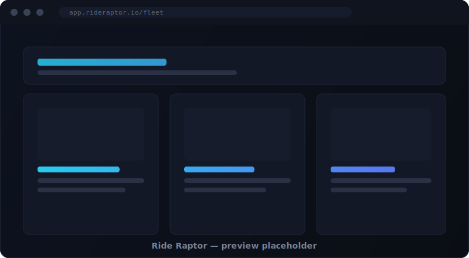
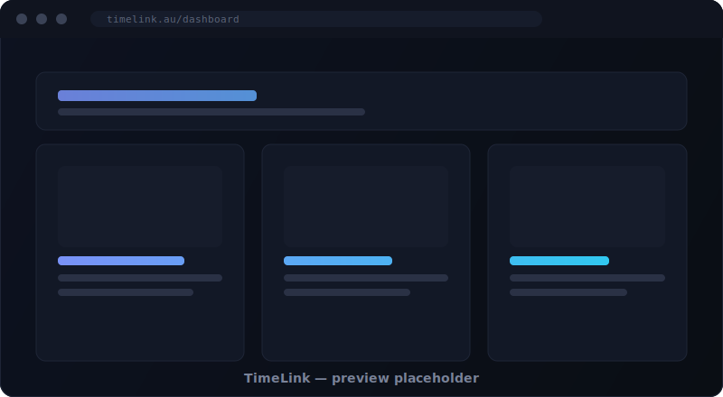
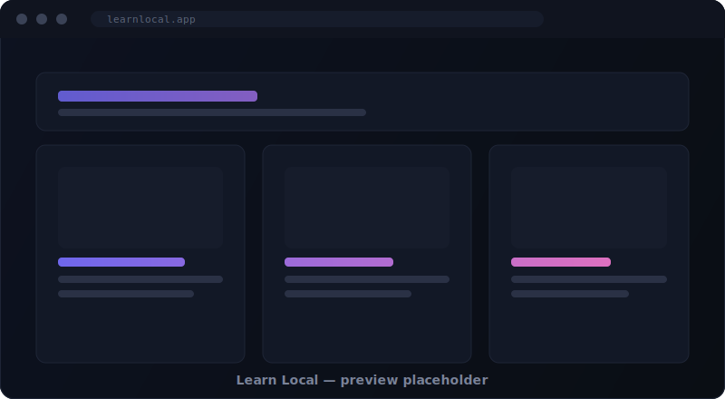
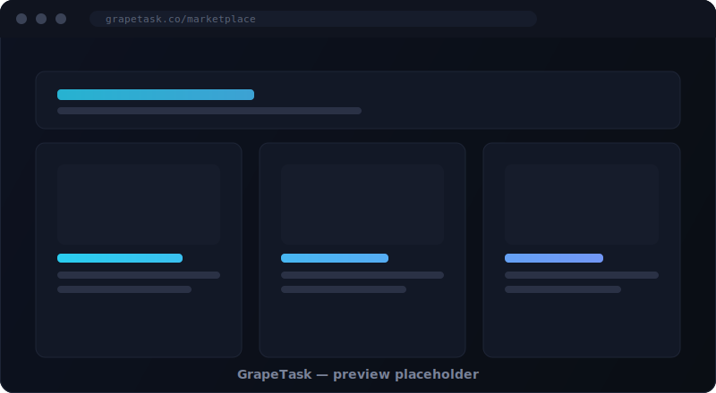
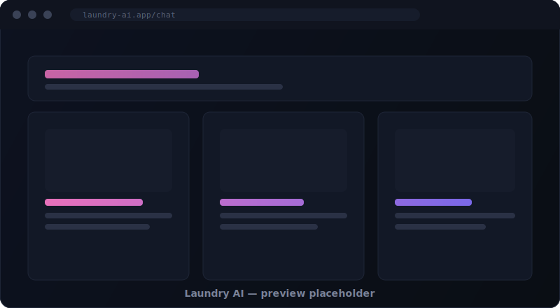

<div align="center">



<br/>

<a href="https://mafzaalali.vercel.app"></a>
<a href="https://linkedin.com/in/m-afzaal-ali"></a>
<a href="mailto:mafzaalali177@gmail.com"></a>

<br/><br/>


</div>

<br/>

## ABOUT

I build scalable SaaS platforms, enterprise applications, marketplaces, AI-powered products, CRM systems, and real-time platforms — for international clients running real production traffic.

My focus sits at the intersection of **backend architecture**, **modern frontend engineering**, and **AI integration into business workflows**. I lead engineering teams and take systems from a whiteboard sketch to something that survives contact with real users.

<table>
<tr>
<td width="50%" valign="top">

**Currently**
- 🧠 Designing AI agent workflows on the OpenAI API
- 🏗️ Architecting distributed, event-driven backends
- 👥 Leading a small full-stack engineering team

</td>
<td width="50%" valign="top">

**Snapshot**
- 📍 Pakistan
- 💼 4+ years in production engineering
- 🌍 International client base

</td>
</tr>
</table>

<br/>

## CAREER HIGHLIGHTS

<div align="center">

| 20+ | 4+ | 1 | ∞ |
|:---:|:---:|:---:|:---:|
| Production Projects | Years of Experience | Team Lead Role | AI Integrations Shipped |

</div>

`Real-Time Systems` `REST APIs` `Payment Systems` `Cloud Deployments` `Backend Architecture` `Frontend Engineering` `System Design` `International Clients`

<br/>

## TECH STACK

<table width="100%">
<tr><td>

**Frontend**
<br/>


</td></tr>
<tr><td>

**Backend**
<br/>


</td></tr>
<tr><td>

**Database & Cache**
<br/>


</td></tr>
<tr><td>

**Cloud & DevOps**
<br/>


</td></tr>
<tr><td>

**AI Engineering**
<br/>


</td></tr>
</table>

<br/>

## ARCHITECTURE EXPERTISE

 &nbsp;What I design and own end-to-end:

<table>
<tr>
<td width="33%" valign="top">

**API & Access**
- REST API design
- GraphQL schemas
- Authentication (OAuth, JWT)
- Role-based access control

</td>
<td width="33%" valign="top">

**Scale & Reliability**
- Redis caching strategies
- Queues & background jobs
- Event-driven systems
- WebSockets at scale

</td>
<td width="33%" valign="top">

**Platform**
- Docker containerization
- CI/CD pipelines
- Database design
- System design for growth

</td>
</tr>
</table>

<br/>

## FEATURED PROJECTS

<table>
<tr>
<td width="45%"></td>
<td width="55%" valign="top">

### Ride Raptor
**Backend Lead** · Real-time Fleet Management Platform

Designed the backend architecture for a real-time fleet management platform: live vehicle tracking, geofencing, and fleet operations at scale.

- Architected REST APIs and the core data model
- Implemented WebSockets for live location streaming
- Built Redis caching layer for hot-path reads
- Delivered geofencing and fleet-management logic

`NestJS` `PostgreSQL` `Redis` `WebSockets` `Docker`

<a href="#"></a>
<a href="#"></a>
<a href="#"></a>

</td>
</tr>

<tr><td colspan="2"><br/></td></tr>

<tr>
<td width="45%"></td>
<td width="55%" valign="top">

### TimeLink
**Full-Stack Developer** · [timelink.au](https://www.timelink.au)

A business operations platform covering scheduling, CRM, reporting, and notifications for day-to-day workflows.

- Built the frontend in React
- Built backend services in Node.js and Laravel
- Delivered scheduling, CRM, and reporting modules
- Implemented business-workflow notifications

`React` `Node.js` `Laravel` `CRM` `Scheduling`

<a href="https://www.timelink.au"></a>
<a href="#"></a>

</td>
</tr>

<tr><td colspan="2"><br/></td></tr>

<tr>
<td width="45%"></td>
<td width="55%" valign="top">

### Learn Local
**Backend Developer & Web Team Lead** · [learnlocal.app](https://learnlocal.app)

Led the web team while building the Laravel API layer that powers the platform.

- Designed and built Laravel APIs
- Led a small engineering team through delivery

`Laravel` `Team Leadership` `REST APIs`

<a href="https://learnlocal.app"></a>
<a href="#"></a>

</td>
</tr>

<tr><td colspan="2"><br/></td></tr>

<tr>
<td width="45%"></td>
<td width="55%" valign="top">

### GrapeTask
**Frontend Developer** · [grapetask.co](https://www.grapetask.co)

A marketplace platform with responsive dashboards and authenticated user flows.

- Built responsive dashboards in React
- Implemented marketplace UX and authentication

`React` `Marketplace` `Authentication`

<a href="https://www.grapetask.co"></a>
<a href="#"></a>

</td>
</tr>

<tr><td colspan="2"><br/></td></tr>

<tr>
<td width="45%"></td>
<td width="55%" valign="top">

### Laundry AI &nbsp;<sub>🟢 current</sub>
**AI Agent** powered by the OpenAI API

A natural-language ordering agent. A user can say *"I want my shirts washed and ironed for the cheapest price"* and the agent understands intent, searches available services, checks cached business data, and finds the best option — then places the order after confirmation.

- Natural language understanding of service requests
- Searches and ranks available providers by price
- Uses cached business data + database lookups
- Places the order automatically after user confirmation

`OpenAI API` `Prompt Engineering` `Workflow Automation` `LLM Integration`

<a href="#"></a>
<a href="#"></a>

</td>
</tr>
</table>

<br/>

## PROFESSIONAL TIMELINE

```
Syntax House
     │
     ▼
Techozon
     │
     ▼
Builtinsoft
     │
     ▼
Aura Agency
     │
     ▼
Sistema Solutions
     │
     ▼
Today — Senior Full-Stack Engineer & Team Lead
```

<br/>

## CURRENT FOCUS

 &nbsp;Where my attention is going right now:

`AI Agents` `OpenAI` `NestJS` `Next.js` `System Design` `Distributed Systems` `Enterprise SaaS`

<br/>

## GITHUB ANALYTICS

<div align="center">


<br/>


<br/><br/>


<br/><br/>

**Contribution Snake**
<br/>
<picture>
  <source media="(prefers-color-scheme: dark)" srcset="./assets/snake.svg" />
  
</picture>

<sub>Generated automatically by <code>.github/workflows/snake.yml</code></sub>

<br/><br/>


<br/><br/>


</div>

<br/>

## OPEN SOURCE

I contribute back where I can and open-source utilities that come out of client work once they're generalized enough to be useful to others. Check the pinned repositories above for active work.

<br/>

## CONTACT

<div align="center">

<a href="https://mafzaalali.vercel.app"></a>
<a href="https://github.com/mrrjatt"></a>
<a href="https://linkedin.com/in/m-afzaal-ali"></a>
<a href="mailto:mafzaalali177@gmail.com"></a>

<br/><br/>

<sub>Open to Senior Full-Stack, Team Lead, and AI Integration roles · Based in Pakistan · Working with clients worldwide</sub>

</div>

<br/>

<div align="center">


`README template & repo scaffolding: /templates` · Built with intent, not defaults.

</div>
