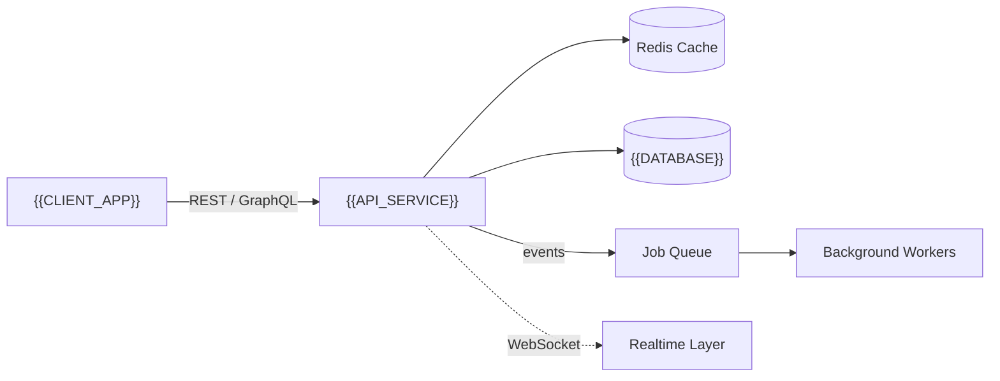

<!--
  PROJECT README TEMPLATE
  Copy this file into any new repository as README.md and replace every
  {{TOKEN}} placeholder. Keep the design tokens (colors, badge style)
  consistent with the main profile so every repo reads as one identity.

  Design tokens used throughout:
    background : #0A0E14      accent 1 : #22D3EE (cyan)
    surface    : #121826      accent 2 : #6366F1 (indigo)
    border     : #1E2536      accent 3 : #818CF8 (soft indigo)
    text       : #E6E8EE      muted    : #7A8399
-->

<div align="center">


<p>


</p>

<a href="{{LIVE_DEMO_URL}}"></a>
<a href="{{DOCS_URL}}"></a>
<a href="{{ISSUES_URL}}"></a>

</div>

<br/>

## Overview

{{ONE_TO_TWO_PARAGRAPH_DESCRIPTION — what the product does, who it's for, and the core problem it solves. Write in plain terms, from the user's side of the screen.}}

**Role on this project:** {{YOUR_ROLE}}

<br/>

## Architecture



{{SHORT_NOTE_ON_KEY_ARCHITECTURAL_DECISIONS — e.g. why Redis, why event-driven, scaling considerations.}}

<br/>

## Folder Structure

```
{{repo-name}}/
├── src/
│   ├── modules/
│   ├── services/
│   ├── controllers/
│   └── config/
├── tests/
├── docker/
├── .github/workflows/
└── README.md
```

<br/>

## Tech Stack

`{{TECH_1}}` `{{TECH_2}}` `{{TECH_3}}` `{{TECH_4}}` `{{TECH_5}}` `{{TECH_6}}`

<br/>

## Screenshots

<table>
<tr>
<td width="50%"></td>
<td width="50%"></td>
</tr>
</table>

<br/>

## Installation

```bash
# Clone the repository
git clone {{REPO_URL}}
cd {{repo-name}}

# Install dependencies
{{PACKAGE_MANAGER}} install

# Configure environment variables
cp .env.example .env

# Run database migrations (if applicable)
{{MIGRATION_COMMAND}}

# Start the development server
{{DEV_COMMAND}}
```

<br/>

## API Documentation

| Method | Endpoint | Description |
|--------|----------|-------------|
| `GET`  | `/api/{{resource}}` | {{DESCRIPTION}} |
| `POST` | `/api/{{resource}}` | {{DESCRIPTION}} |
| `PUT`  | `/api/{{resource}}/:id` | {{DESCRIPTION}} |
| `DELETE` | `/api/{{resource}}/:id` | {{DESCRIPTION}} |

Full API reference: {{DOCS_URL}}

<br/>

## Deployment Guide

```bash
# Build the production image
docker build -t {{IMAGE_NAME}} .

# Run with environment config
docker run -p {{PORT}}:{{PORT}} --env-file .env {{IMAGE_NAME}}
```

{{NOTES_ON_CI_CD — link to the .github/workflows pipeline handling deploys, target environment, rollback strategy.}}

<br/>

## Roadmap

- [ ] {{UPCOMING_FEATURE_1}}
- [ ] {{UPCOMING_FEATURE_2}}
- [ ] {{UPCOMING_FEATURE_3}}
- [x] {{COMPLETED_MILESTONE}}

<br/>

## License

Distributed under the {{LICENSE}} License. See `LICENSE` for details.

<br/>

<div align="center">
<sub>Built by <a href="https://github.com/mrrjatt">Muhammad Afzaal Ali</a> — part of a consistent engineering portfolio.</sub>
</div>
